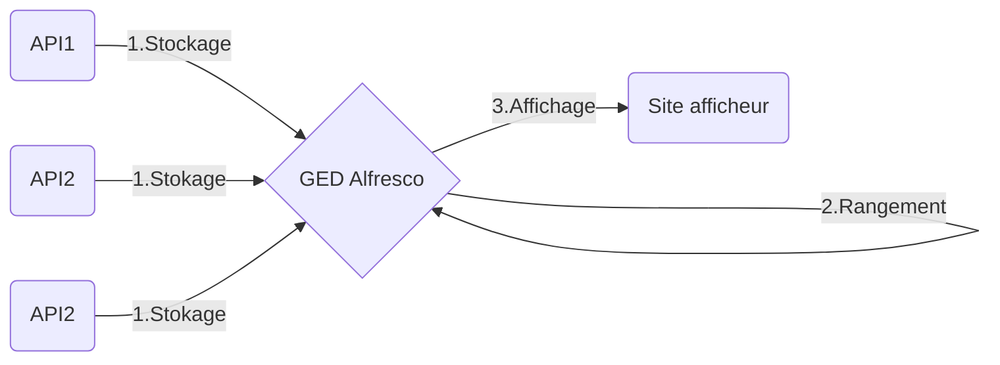

## Affichage des actes
## Objectifs
L'objectif de ce développement est de répondre à l'obligation des départements concernant publicité des actes qui est rentrée en vigueur le 1er juillet 2022. Cette réforme fait de la dématérialisation le mode de publicité de droit commun.

De ce fait, le département du Nord signant déjà des délibérations et actes électroniquement, ceux-là seront aussi affichés de cette manière.

Ce développement concerne le stockage et l'envoie à l'affichage des délibérations et arrêtés signés électroniquement par  
le département du Nord.

## Fonctionnement
Le stockage se fera sur une GED (Gestion Electronique de Documents) Alfresco.
Dans un premier temps, les documents seront déposés en GED soit manuellement via l'interface graphique ou, soit par des applications tierces (Oxyact, Pastell, ...) et développements personnalisés via les webservices que proposent l'architecture Alfresco (CMIS, REST).

Ces instances créeront un dossier dans un dossier *SAS* mis à leur disposition en GED.

Ce nouveau dossier sera enrichi de métadonnées qui serviront par la suite au classement de l'acte. Les documents liés à l'acte y seront déposés (eux aussi enrichis de métadonnées). Enfin, une fois le dossier complet sa complétion sera signifier au système par la mise à jour d'une métadonnée du dossier.

Lorsque la métadonnée de complétion est valide, alors la seconde étape est lancée : **Le classement de l'acte**.

Les métadonnées du dossier de l'acte créé par l'application tierce devra permettre le classement dans le plan ci-dessous :
```
.
├── SAS
└── Actes
    └── 2022
        └── 01
            └── 01
                ├── DELIBERATIONS
                |	 └── DEL_DAJAP_2022_001
	            |    	 ├── Acte_original                
	            |    	 └── Annexe_1
                └── ARRETES
	                ├── Acte_original                
	                ├── Annexe_1
	                └── Annexe_2
```
Pour explication, à la racine de la GED se trouvera un dossier appelé **Actes** dans lequel on placera tous les dossiers d'actes.

Tout d'abord, pour rappel **un dossier est signé à une date**. Cette date sera la base de notre **plan de classement** et se matérialisera dans l'arborescence sous cet ordre : l'**année**, le **mois** et le **jour**.

Ensuite, un dossier est d'un certain **type** (pour le moment **arrêté** ou **délibération**), ce type donnera profondeur supplémentaire au plan de classement.

Enfin, grâce aux métadonnées fournies. La GED sera en capacité de générer un nom de dossier.